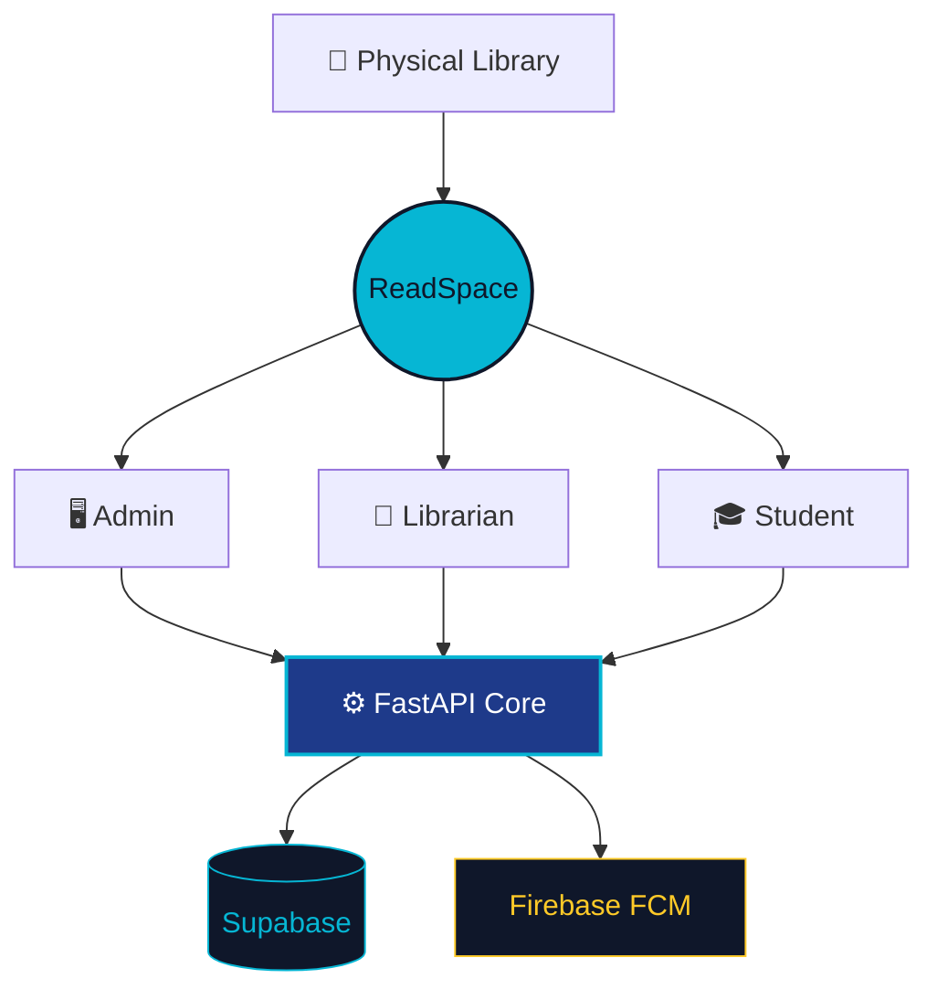
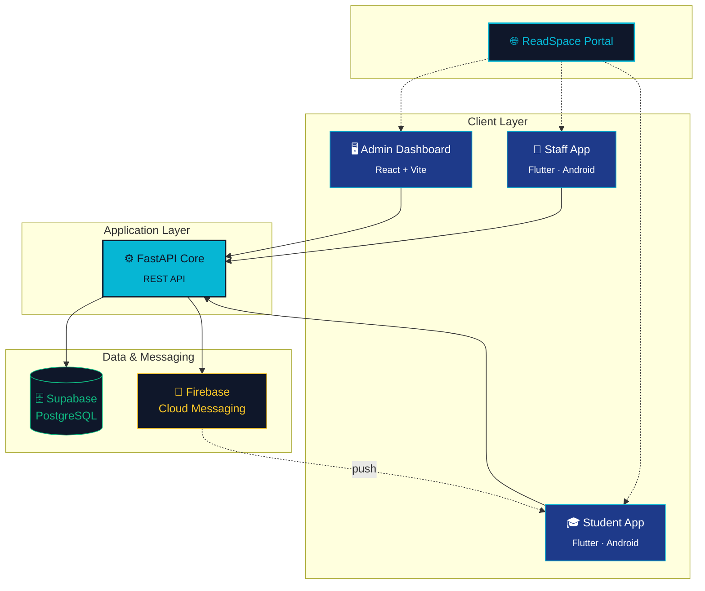
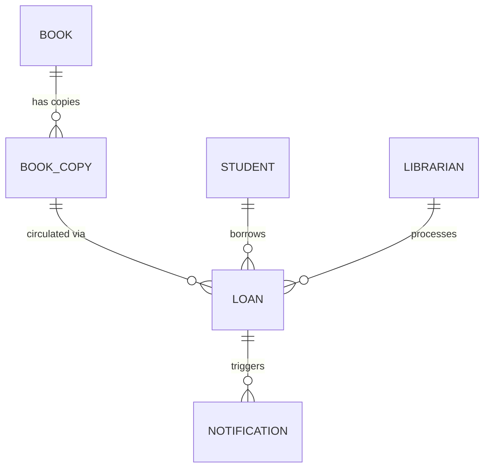

<div align="center">


<br/>

<a href="https://readspace-portal.vercel.app">
  
</a>

<br/><br/>

[](https://readspace-portal.vercel.app)
[](https://readspace-dashboard.vercel.app)
[](https://github.com/Zeenat-25/ReadSpace)

<br/>


<br/><br/>

**About** • **[Architecture](#-system-architecture)** • **[Features](#-the-experience)** • **[Screenshots](#-product-experience)** • **[Stack](#-technology)** • **[Setup](#-getting-started)** • **[Developer](#-built--engineered-by)**

</div>

<br/>

## About

ReadSpace is not a single app — it's **four connected interfaces sharing one intelligent backend**. An admin manages the catalog, a librarian circulates physical books, a student tracks everything from their pocket, and every action syncs across all of them in real time.



<br/>

## 🧭 System Architecture



Four independent clients. One FastAPI core. One PostgreSQL source of truth. Firebase closes the loop — no client ever talks to another directly.

<br/>

## ⚡ The Experience

### 🖥 Admin Command Center
> Control the entire library from one place.

`Books` `Students` `Librarians` `Loans` `Reports` `Live Activity`

- Real-time overview — total, available, and issued copies
- Add books, students, and librarians *(admin-exclusive)*
- Full directories, search, and issue/return controls from the dashboard
- Overdue tracking, fine visibility, and a live notification feed
- Dashboard updates automatically — no manual refresh

---

### 📱 Librarian Companion
> Built for the circulation desk.

`Scan` `Issue` `Return` `Lookup` `Activity`

- Login by Employee ID, validated against the backend
- Scan a book's accession code, or enter it manually
- Issue and return with instant confirmation
- View active loans and recent circulation activity
- No administrative powers — staff circulate, they don't create records

---

### 🎓 Student Experience
> Your library, in your pocket.

`Search` `Borrowed Books` `Due Dates` `Fine` `Notifications`

- Login by Student ID, search the live catalog
- Track borrowed books, issue dates, and due dates
- Automatic overdue detection and fine calculation
- Push notifications — even when the app is closed
- Full read/unread notification history

<br/>

## 🔄 Where It Comes Alive

```mermaid
flowchart LR
    SCAN["📷 Scan"] --> ISSUE["📗 Issue"]
    ISSUE --> SYNC["🔄 Sync"]
    SYNC --> NOTIFY["🔔 Notify"]
    NOTIFY --> TRACK["📊 Track"]
    TRACK --> RETURN["↩️ Return"]
    RETURN --> CALC["🧮 Calculate"]
    CALC --> FREE["✅ Available"]

    style SCAN fill:#1E3A8A,color:#fff
    style ISSUE fill:#1E3A8A,color:#fff
    style SYNC fill:#06B6D4,color:#0F172A
    style NOTIFY fill:#FFCA28,color:#0F172A
    style TRACK fill:#06B6D4,color:#0F172A
    style RETURN fill:#1E3A8A,color:#fff
    style CALC fill:#EF4444,color:#fff
    style FREE fill:#10B981,color:#0F172A
```



**Issue flow**

`Librarian issues book` → `Database updates` → `Student notified` → `Student app reflects the loan` → `Dashboard reflects the activity`

**Return flow**

`Librarian returns book` → `Fine calculated automatically` → `Book becomes available` → `Student notified` → `Dashboard updates`

<br/>

## 💰 Smart Fine Engine

| | |
|---|---|
| **Loan period** | `7 days` |
| **Fine rate** | `₹5 / overdue day` |

> **Due** `10 Aug` → **Returned** `13 Aug` → **Late** `3 days`
>
> ### `3 × ₹5 = ₹15`

Calculated automatically the moment a return is recorded. No manual math.

<br/>

## 🛠 Technology

<div align="center">


</div>

| Layer | Stack |
|---|---|
| **Frontend** | React · Vite · JavaScript · CSS |
| **Mobile** | Flutter · Dart · `mobile_scanner` |
| **Backend** | Python · FastAPI · REST APIs |
| **Database** | Supabase · PostgreSQL |
| **Messaging** | Firebase Cloud Messaging · Firebase Admin SDK |
| **Deployment** | Vercel (web) · Render (backend) |

<br/>

## 🗄️ Data Model



Each `book` can have many `book_copies`, and every copy is either `available` or `issued` — nothing else. A `loan` links a student, a copy, and the librarian who processed it. Closing a loan frees the copy and may generate a fine. Loan events generate `notifications` delivered straight to the student.

<br/>

## 📁 Project Structure

```
ReadSpace/
│
├── backend/                 → FastAPI core · business logic · Supabase & FCM integration
├── library-dashboard/       → Admin Dashboard (React + Vite)
├── readspace_staff/         → Librarian App (Flutter)
├── readspace_student/       → Student App (Flutter)
└── readspace-portal/        → Public Portal (React + Vite)
```

<br/>

## 🖼 Product Experience

### Admin Command Center

<!--
ADD IMAGE HERE:
Admin Dashboard → main dashboard/overview screen
Suggested filename: assets/admin-dashboard.png
-->


<br/>

<table>
<tr>
<td align="center" width="50%"><b>Staff App — Home</b></td>
<td align="center" width="50%"><b>Student App — Home</b></td>
</tr>
<tr>
<td align="center">
<!--
ADD IMAGE HERE:
Staff App → home screen
Suggested filename: assets/staff-home.png
-->

</td>
<td align="center">
<!--
ADD IMAGE HERE:
Student App → home screen
Suggested filename: assets/student-home.png
-->

</td>
</tr>
<tr>
<td align="center"><b>Issue Book</b></td>
<td align="center"><b>Push Notification</b></td>
</tr>
<tr>
<td align="center">
<!--
ADD IMAGE HERE:
Staff App → issue book confirmation screen
Suggested filename: assets/staff-issue.png
-->

</td>
<td align="center">
<!--
ADD IMAGE HERE:
Student App → notification screen
Suggested filename: assets/student-notification.png
-->

</td>
</tr>
</table>

<br/>

## 🔐 Environment & Security

The backend requires **Supabase credentials** and **Firebase configuration** to run, supplied through environment variables or your deployment platform's secure configuration.

Never commit:

`.env` · Firebase service-account JSON · API secrets

Only Admin can create books, students, or librarian accounts, and every librarian action is validated server-side before it touches the database.

<br/>

## ☁️ Deployment

| Component | Platform |
|---|---|
| Portal | Vercel |
| Dashboard | Vercel |
| Backend | Render |
| Database | Supabase |
| Notifications | Firebase Cloud Messaging |

<br/>

## 🧩 Product Philosophy

ReadSpace isn't a CRUD library website — it's a system with separated responsibilities:

`Admin → Management`  ·  `Librarian → Physical circulation`  ·  `Student → Personal experience`  ·  `Backend → Business logic`  ·  `Supabase → Shared truth`  ·  `Firebase → Event delivery`

Each piece does one job well, and the backend is the only thing that's allowed to be right.

<br/>

## 👩‍💻 Built & Engineered By

<div align="center">

### Zeenat Asrar Ansari

[](https://github.com/Zeenat-25)
[](https://www.linkedin.com/in/zeenat-ansari-ab566b353)

</div>

<br/>

<div align="center">

**One library. Three experiences. One connected system.**

*— ReadSpace*


</div>
